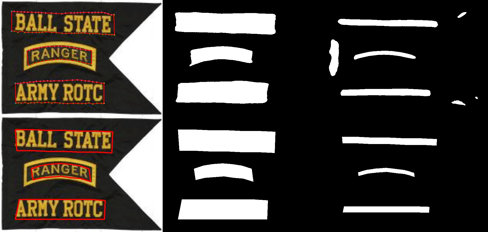

## FARNet

## get ready
**python 3.7**;  
**PyTorch 1.2.0**;   
**Numpy >=1.16**;   
**CUDA 10.1**;  
**GCC >=9.0**;   
**NVIDIA GPU(with more than 10G memory for inference)**;   

 ## Compile  
```
cd ./csrc and make
cd ./nmslib/lanms and make
```  
## Datasets
Note:  download the data and put it under the data file  
1. [CTW1500](https://drive.google.com/file/d/1A2s3FonXq4dHhD64A2NCWc8NQWMH2NFR/view?usp=sharing)   
2. [TD500](https://drive.google.com/file/d/1ByluLnyd8-Ltjo9AC-1m7omZnI-FA1u0/view?usp=sharing)  
3. [Total-Text](https://drive.google.com/file/d/17_7T_-2Bu3KSSg2OkXeCxj97TBsjvueC/view?usp=sharing)  


## parameter
```
you can modify the paramters in util/option.py in advance
```

## Train
```
python train_TextGraph.py --exp_name Ctw1500 --max_epoch 600 --batch_size 8 --gpu 0,1,2,3 --input_size 640 --optim SGD --lr 0.001 --start_epoch 0 --viz --net vgg 
# --resume pretrained/mlt2017_pretain/textgraph_vgg_100.pth ### load the pretrain model,  You should change this path to your own 
```

## Eval
```
python  eval_TextGraph.py # Testing single round model 
or 
python  batch_eval.py #  Testing multi round models 
```   

## Qualitative results


  

## References  

--------------------------

## License
This project is licensed under the MIT License - see the [LICENSE.md](https://github.com/GXYM/DRRG/blob/master/LICENSE.md) file for details

## Ongoing maintenance~
